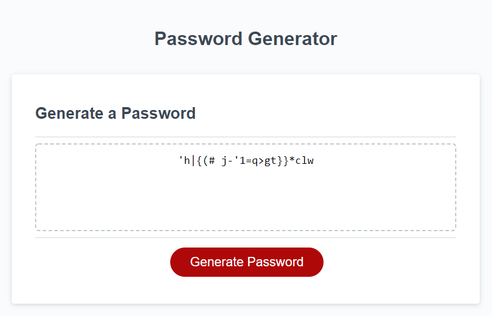

# Password-Generator

## Table of Contents

* Description
* Usage
* Images
* License

---

## Description
> Goals of this assignment included the following:

1. Apply learned JavaScript syntax to add functionality to a web application.

2. Create a password generator that generates a random string of characters based on users' preferences of character length and the inclusion or exclusion of charcter types such as lowercase, uppercase, numeric, and special.

3. Display generated password in the textarea for user to view. 

---

## Usage
> This web application can generate a random password between 8 to 128 characters in length. 

Access the webpage here:

<https://pao1ag.github.io/Password-Generator/>

## Images

## License

This project is licensed under MIT License.